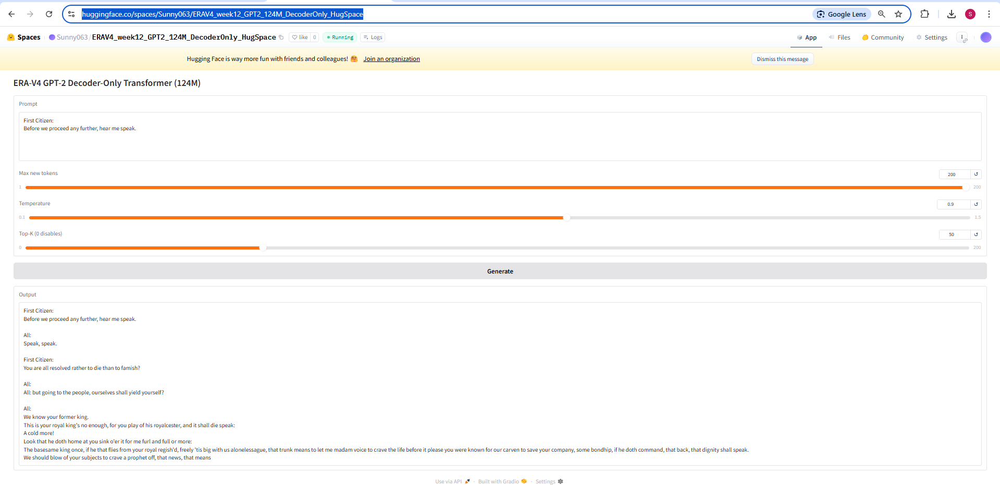

# ERA-V4 — Train a Decoder-Only Transformer (GPT-2 Style) From Scratch

## Objective
Train a **decoder-only Transformer (GPT-2 style, ≥124M parameters)** **from scratch** (no pretrained weights) on the provided `input.txt` until **training loss < 0.099999**.

## Quick Links
- Training script: `train.py`
- Dependencies: `requirements.txt`
- Run outputs (generated): `out/` (gitignored)

## Repository Structure (recommended)
```text
.
├─ train.py
├─ requirements.txt
├─ README.md
├─ update_readme.py
├─ .gitignore
├─ data/
│  ├─ input.txt               # commit only if permitted by the course
│  └─ README.md               # where to place input.txt if not committed
└─ out/                       # generated (gitignored)
   ├─ logs/
   ├─ samples/
   └─ checkpoints/
```

## Environment
- GPU: RTX 4060 Ti (16 GB)
- CPU: i7
- RAM: 32 GB
- OS: [Windows/Linux]
- Python: 3.10+ recommended

## Setup

### Create environment
```bash
python -m venv .venv
# Windows
.venv\Scripts\activate
# Linux
source .venv/bin/activate
```

### Install dependencies
```bash
pip install -r requirements.txt
```

### Dataset placement
Place the provided dataset at:
- `data/input.txt` (recommended)

## Train

### Sanity-check run (2–5 minutes)
```bash
python train.py \
  --input_file data/input.txt \
  --out_dir out_sanity \
  --steps 200 \
  --batch_size 4 \
  --seq_len 128 \
  --grad_accum 1 \
  --lr 3e-4 \
  --log_every 10 \
  --save_every 100 \
  --sample_every 100
```

### Full training run
```bash
python train.py \
  --input_file data/input.txt \
  --out_dir out \
  --steps 200000 \
  --batch_size 8 \
  --seq_len 256 \
  --grad_accum 4 \
  --lr 3e-4 \
  --log_every 50 \
  --save_every 2000 \
  --sample_every 2000
```


### PowerShell wrapper for long training runs (Windows)

For long-running or overnight training on Windows, you can use the included PowerShell wrapper script `training.ps1`.

This wrapper **invokes the same `train.py` entry point** and passes the arguments in a PowerShell-friendly way (via an argument array), typically including GPU-optimized settings such as AMP (`--amp fp16`) and early stopping (`--target_loss`).  
The **training logic, model architecture, and loss function are identical** — only the way arguments are provided differs.

#### How to run

From the repository root (PowerShell):

```powershell
.\training.ps1
```

Internally, the script executes:

```powershell
python train.py @trainArgs
```

where `@trainArgs` contains the same flags you would otherwise pass on the command line.

#### Why use `training.ps1`?

- Avoids long multi-line CLI commands in PowerShell
- Safer for overnight runs (single entry point)
- Easier to tune `--batch_size` and `--grad_accum` for the local GPU
- Supports AMP and early stopping configuration in one place

> Note: The CLI commands above remain the **canonical documentation** for cross-platform reproduction.  
> `training.ps1` is provided as a **Windows convenience wrapper**.

## Model
GPT-2 style decoder-only Transformer trained from scratch (no pretrained weights).
- Tokenizer: GPT-2 BPE via `tiktoken`
- Causal LM loss: cross-entropy over next-token prediction

(If you changed the config, document it here.)

## Outputs / Artifacts
Training produces the following under the run directory (`--out_dir`, e.g. `out/`):
- Logs:
  - `logs/train.log`
  - `logs/train_metrics.csv` (step, loss, etc.)
- Samples:
  - `samples/samples.txt` (periodic generations)
- Checkpoints:
  - `checkpoints/last.pt` (resume)
  - `checkpoints/best.pt` (lowest loss)


### What is `samples/samples.txt` and how is it generated?

During training, the script periodically performs **inference-only sampling** to qualitatively check what the model has learned so far.  
This is controlled by:

- `--sample_every N`: generate samples every **N training steps**
- `--prompt "...":` the text prompt used to start generation (default: `BIANCA:\n`)
- `--num_prompts K`: how many generations to produce per sampling event
- `--max_new_tokens M`: how many **new tokens** to generate after the prompt
- `--top_k` and `--temperature`: sampling controls (diversity vs. determinism)

**What gets written to `samples.txt`:**
- The current **STEP** number
- The **PROMPT** string used
- The model’s **OUTPUT** continuation, generated **autoregressively** (next-token prediction repeated `max_new_tokens` times)
- A separator line for readability

**Important:** `samples.txt` is **not used for training loss**.  
Loss is computed only from next-token prediction on the training batches.  
Samples are generated to provide **human-readable evidence** that the model is learning the text distribution and formatting (e.g., Shakespeare-style dialogue).

**Where this happens in training (conceptually):**
1. Training runs normally for many steps (forward → loss → backward → optimizer step).
2. When the step hits a multiple of `--sample_every`, training briefly switches to `model.eval()` (no gradients).
3. The prompt is tokenized using the same tokenizer as training.
4. The model repeatedly predicts the next-token distribution and samples tokens until `--max_new_tokens` is reached.
5. The decoded text is appended to `samples/samples.txt`.

This is why, when prompted with `BIANCA:\n`, the model generates dialogue-like continuations and speaker tags it learned from `input.txt`.

**Keep safe (for grading + later deployment):**
- `checkpoints/best.pt`
- `logs/train_metrics.csv`
- `samples/samples.txt`

## Results (auto-updated)
This section is **auto-filled** by `update_readme.py`.


### Loss curve (from `logs/train_metrics.csv`)
<!--AUTO:PLOT:START-->
_Run `python update_readme.py --out_dir <RUN_DIR>` to generate and link the loss plot._
<!--AUTO:PLOT:END-->


### Summary
<!--AUTO:SUMMARY:START-->
> Run `python update_readme.py --out_dir out` to populate this section.
<!--AUTO:SUMMARY:END-->

### Training log excerpt
<!--AUTO:LOGS:START-->
```text
(placeholder)
```
<!--AUTO:LOGS:END-->

### Key metrics
<!--AUTO:METRICS:START-->
| Metric | Value |
|---|---|
| Best loss | (placeholder) |
| Step at best loss | (placeholder) |
| Last logged loss | (placeholder) |
| Total logged steps | (placeholder) |
<!--AUTO:METRICS:END-->

### Sample generations
<!--AUTO:SAMPLES:START-->
```text
(placeholder)
```
<!--AUTO:SAMPLES:END-->

## Updating the README automatically

After a training run completes (or after a sanity run), update the auto-filled sections of this README (summary, metrics, log excerpt, samples, and loss plot) using:

**Windows (PowerShell)**
```powershell
python update_readme.py --out_dir out\runs\gpt2_124m_bs8_sl128_ga16_lr3e-4 --readme README.md
```

**Linux/macOS**
```bash
python update_readme.py --out_dir out/runs/gpt2_124m_bs8_sl128_ga16_lr3e-4 --readme README.md
```

Notes:
- `--out_dir` must point to the **run directory** that contains `logs/`, `samples/`, and `checkpoints/`.
- The script generates the loss plot from `logs/train_metrics.csv` and saves it next to the logs as `logs/loss_curve.png`.

## 🤗 Hugging Face Space (Live Demo)

A live interactive demo of the trained **decoder-only Transformer (GPT-2 style, ~124M parameters)** is deployed on Hugging Face Spaces.

🔗 **Space URL:**  
https://huggingface.co/spaces/Sunny063/ERAV4_week12_GPT2_124M_DecoderOnly_HugSpace

The Space loads the **best training checkpoint (`best.pt`)** for inference only and allows users to generate text autoregressively from custom prompts.

### 🖼️ Screenshots
Place screenshots under `assets/` and reference them here.

- **Space UI main page**  
  

- **Example generation output**  
  

### 🎛️ Inference Controls Explained

**Max new tokens**
- Maximum number of tokens generated after the prompt
- Controls output length (not characters or words)
- Higher values increase latency on CPU
- Typical range: `50–120`

**Temperature**
- Controls randomness in token sampling
- Lower values → deterministic outputs
- Higher values → more creative but noisy outputs

| Temperature | Behavior |
|------------|----------|
| 0.1–0.3 | Very deterministic |
| 0.7–0.9 | Balanced (recommended) |
| ≥1.0 | Creative, higher risk of incoherence |

**Top-K (0 disables)**
- Restricts sampling to the K most probable tokens
- Prevents low-probability token noise
- `Top-K = 0` disables filtering

Recommended range: `30–70`

### 🔁 Reproducibility
- **Seed:** `1337`
- **Exact training command:**
  ```bash
  python train.py     --input_file data/input.txt     --out_dir out     --steps 200000     --batch_size 8     --seq_len 256     --grad_accum 4     --lr 3e-4     --log_every 50     --save_every 2000     --sample_every 2000
  ```
- **Best loss achieved:** `≈ 0.08986`

## Understanding the Decoder‑Only Transformer (Sequence‑Based Training)
This project trains a **decoder‑only Transformer (GPT‑2 style)** for **next‑token prediction** on a single text corpus (`input.txt`). The model is trained **from scratch**, without any pretrained weights.
### How the data is used
- The entire `input.txt` file is treated as **one continuous stream of tokens**.
- At each training step:
  - `batch_size` independent sequences are sampled.
  - Each sequence has length `seq_len` tokens.
- For every sequence:
  - **Input**: tokens `[t0, t1, ..., t127]`
  - **Target**: tokens `[t1, t2, ..., t128]`
- The model learns to predict the **next token at every position**.
There is **no sentence boundary requirement** — sequences are random slices from the token stream.
### What the Transformer computes
For each batch:
- Input shape: `(batch_size, seq_len)`
- Output logits shape: `(batch_size, seq_len, vocab_size)`
Loss is computed using **cross‑entropy**, averaged over:
```
batch_size × seq_len
```
token predictions.
### Attention behavior
- **Self‑attention operates only within each sequence**.
- Tokens in one batch row never attend to tokens in another row.
- The batch dimension is used only for computational parallelism.
### Training is step‑based (not epoch‑based)
Unlike classical datasets, this training setup **does not use epochs**.
- One **step** = one optimizer update.
- Each step processes:
```
batch_size × seq_len × grad_accum
```
tokens.
Since token sequences are sampled randomly from a continuous stream:
- There is no well‑defined “one full pass over the dataset”.
- Progress is measured in **steps and total tokens processed**, not epochs.
A rough *pseudo‑epoch* can be estimated as:
```
(total tokens processed) / (total tokens in input.txt)
```
but this is only an approximation.
